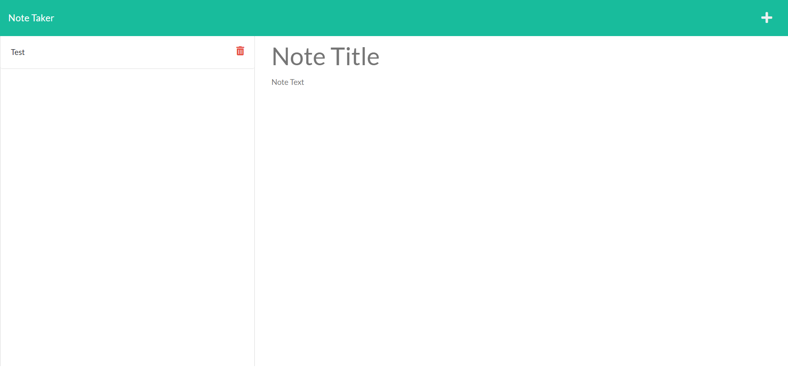
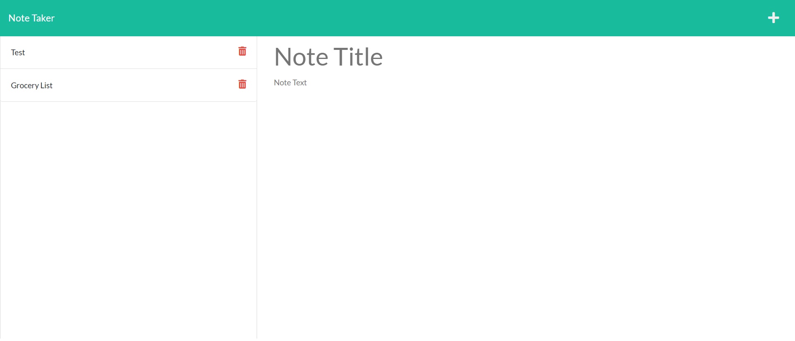

## Description

This application uses Express.js back end to write and save/retrieve note data from a JSON file. The note app also allows the user to delete existing notes to better keep track and organize thoughts and tasks needed to complete.

### Links

Heroku Deployed Site URL: []

#### Screenshot

