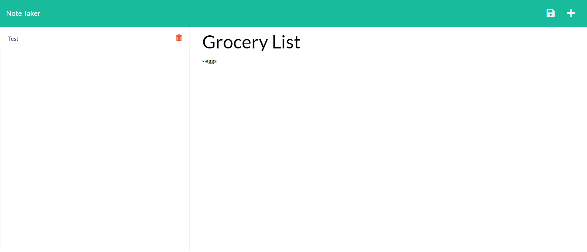

## Description

This application uses Express.js back end to write and save/retrieve note data from a JSON file. The note app also allows the user to delete existing notes to better keep track and organize thoughts and tasks needed to complete.

### Install

Here are the instructions for installation:
Clone project. Run the following line of code in your terminal to install all the needed packages:

npm i

Once all the packages have been installed, open terminal and run the following code in command line :

node server.js

This will run the server where you can find the page on localhost:3001. To end your server in your terminal type: control + c

#### Screenshot

